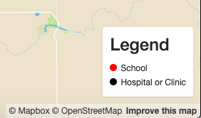
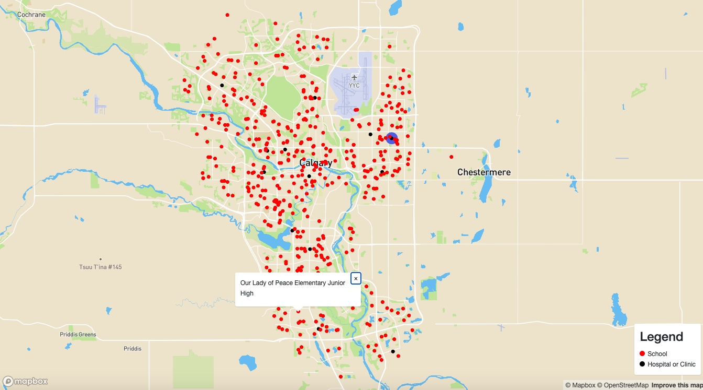
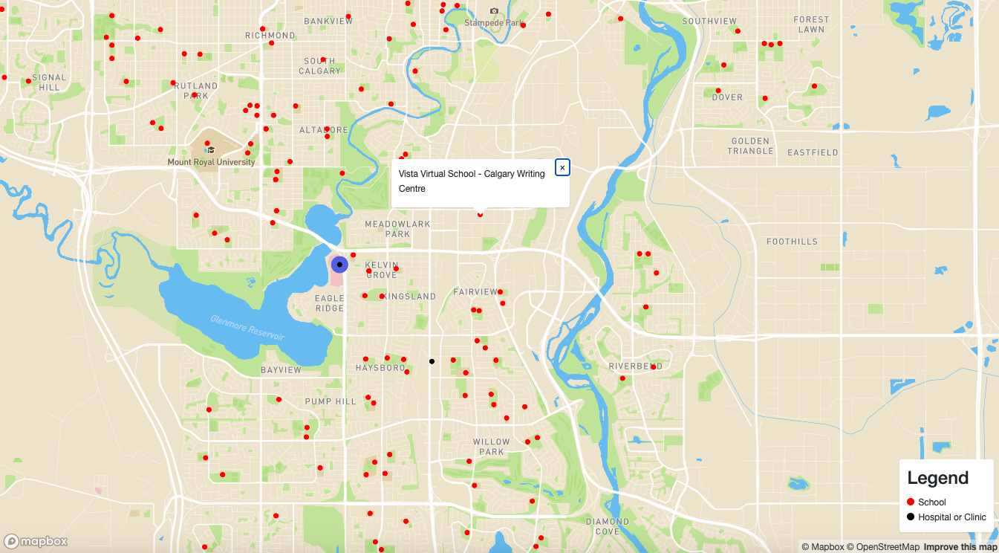

# Project 
## ENGO 551 Project 4
### By: Sam Knight

When a user enters the page they see two layer:
Red cirlces for schools
Black circles for hospitals and clinics
As shown in the legend at the bottom right corner.

If a school, hospital, or clinic is hovered over, the name will appear.

If a school is clicked the closest hospital has a blue circle appear around it.

